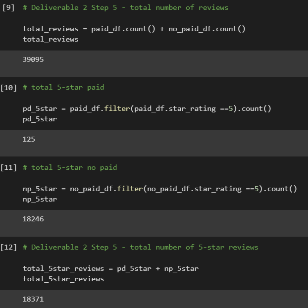

# Amazon Vine Analysis
## Overview
The research department of SellBy has been asked to research reviews from Amazon for their home improvment product line to determine if there is bias in reviews using the Amazon Vine program. The Amazon Vine program is a paid service provided to Amazon sellers, where "trusted" reviewers are used to post opinions about the products they review. To determine bias, the research department will compare 5-star reviews from both Vine reviews and reviews not submitted through the program.

### About Amazon Vine
"Vine invites the most trusted reviewers on Amazon to post opinions about new and pre-release items to help their fellow customers make informed purchase decisions. Amazon invites customers to become Vine Voices based on their reviewer rank, which is a reflection of the quality and helpfulness of their reviews as judged by other Amazon customers. Amazon provides Vine members with free products that have been submitted to the program by participating vendors. Vine reviews are the independent opinions of the Vine Voices. The vendor cannot influence, modify or edit the reviews." (Source: <a href="https://www.amazon.com/vine/about">See about page</a>.)

## Results
The DataFrames and counts needed to compare Vine paid reviews to non-paid reviews were compiled using PySpark in Google Colaboratory. The ipynb file is available <a href = "Vine_Review_Analysis.ipynb">here</a>.

### Steps and code to obtain data
1. Filter the data to retrieve all rows where total_votes >=20

    ```
    filter_home_improve_df = home_improve_df.filter(home_improve_df.total_votes>=20)
    .select(['review_id','star_rating','helpful_votes','total_votes','vine','verified_purchase'])
    ```
2. Filter the total votes to those where helpful_votes divided by total_votes >=50%

```
hi_helpful_df = filter_home_improve_df.filter((filter_home_improve_df.helpful_votes / filter_home_improve_df.total_votes) >= 0.5)
```

3. Filter the data to return only Vine reviews

```paid_df = filter_home_improve_df.filter(hi_helpful_df.vine == 'Y')```

4. Filter the data to return only non-Vine reviews

```no_paid_df = filter_home_improve_df.filter(hi_helpful_df.vine == 'N')```

5. Total number of reviews is 41,458, and total 5-star reviews is 18,588 as seen below:



6. Percent of 5-star Vine paid reviews is 46.8% and for non-paid reviews is 44.8% as seen below:


## Summary

